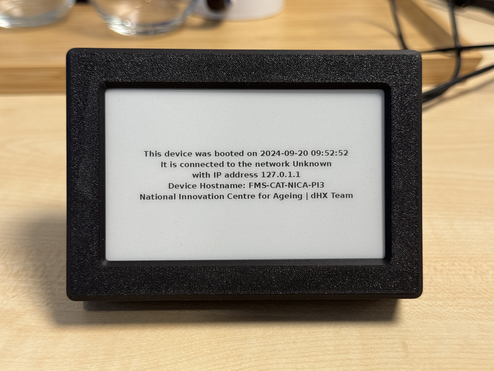
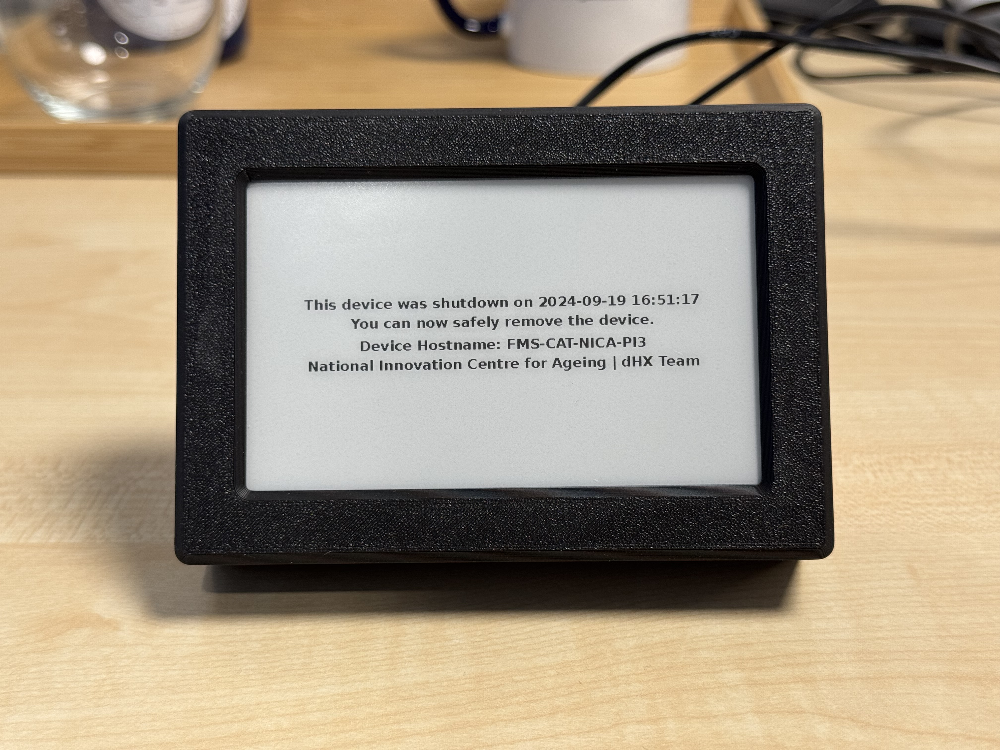

# Behaviour-Insight-Device-Development

This repository contains the tools developed by the Digitising Human Experience Programme Design Team for the design and internal iteration phases.

### bootmsg.py
This script runs automatically upon powering on the Raspberry Pi. It displays the boot time, the connected network, and the device's IP address or hostname on the e-ink display.

 

### imageviewer.py
This script allows users to display an image on the e-ink display with the correct orientation for hardware version 7.

### safepoweroff.py
This script runs during the Raspberry Pi's shutdown process. It displays the shutdown time and the device's hostname on the e-ink display.

 
 
### slideshow.py
This script allows users to display a slideshow of images stored in the `./slideshow` directory on the e-ink display, with the correct orientation for hardware version 7. Images must be named in the following format: `1.png`, `2.png`, ..., `x.png`.
